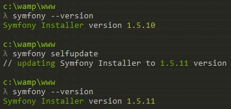
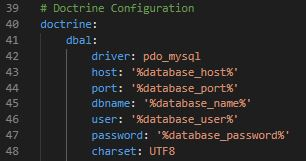
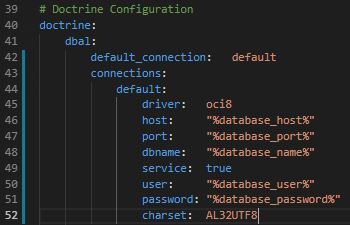
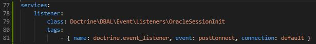
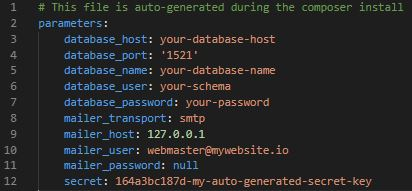
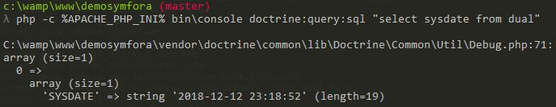
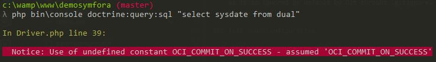

Symfony framework 3.4 connecting to an Oracle DB
====================================================

Symfony 3.4 project just configured to access an Oracle database

## Description

Symfony comes with default configuration to a MySQL DB. From that initial project,
we configure step by step the project to connect to a Oracle DB.

Thereso, this project illustrate the configuration of a symfony 3.4 project in order to
interact with a Oracle Database instead of the default MySQL config.

## Prerequisites

* Symfony installer installed - no pun intended :-)!
* Oracle instant client v.12 min installed
    * For Windows, install the client with the administration mode and make sure to set php_oci8_12c extension manually in the **right** php.ini
    * For Linux, [visit this tutorial](https://gist.github.com/hewerthomn/81eea2935051eb2500941a9309bca703 "Install OCI on Linux"). Worked like a charm for me :-).

## Environment

* Oracle Database of course
* Wamp or similar tool with PHP 7.x

## Step by step

### Create your Symfony project

* Update symfony installer if necessary

    

* Create project with the following command
```
    symfony new <project_name> "3.4"
```
* Update the README.md file to fit your project

### Configure Oracle Connection

* In the app/config/config.yml file

    * replace the following lines...

        

    * ... with the following line

        

    * Add the following config to avoid error when dealing with DATE field

        

* In the app/config/parameters.yml, set your connection to your oracle DB

    

    If you've cloned this project, you'll have to manually create that file as it is ignored by default by Git throuht .gitignore. Keep it that way of course :-)!

### Test your connection

* In CLI mode, execute the following command

    
    
    The "-c %APACHE_PHP_INI%" parameter is a global variable created on my machine. It indicate the path to my apache's php.ini file. Without it you'll probably run into this OCI_COMMIT_ON_SUCCESS awfull error

    

    Any kind of error you may run into may be due to the way you installed your oracle client or configured your PHP extensions so check that as well.

Hope this information helps! And most of all, enjoy the ride :-) !

